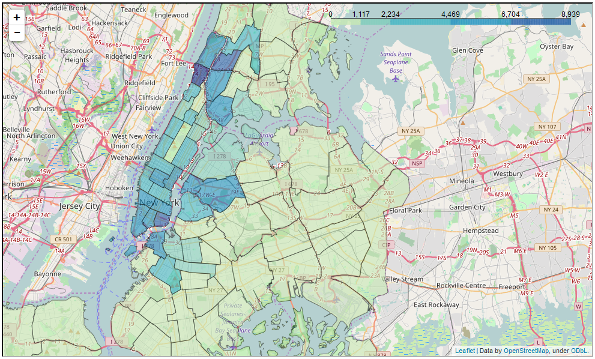

<h1>NYC Parking Tickets Choropleths Example</h1>

Fun with Pandas and Folium to create choropleths, using 30M+ NYC parking ticket summons from NYC from 2013-2016. Data sourced from Socrata's NYC Open Data portal. The main analysis is in the Jupyter notebook.

An example choropleth (same choropleth as in notebook), for the total number of summonses given in each NYC precinct for "Stopping, standing or parking within a marked bicycle lane" in 2014 and 2015:

